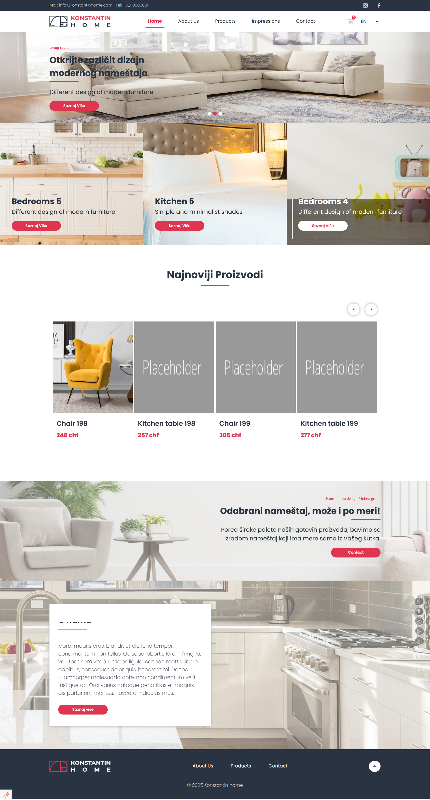
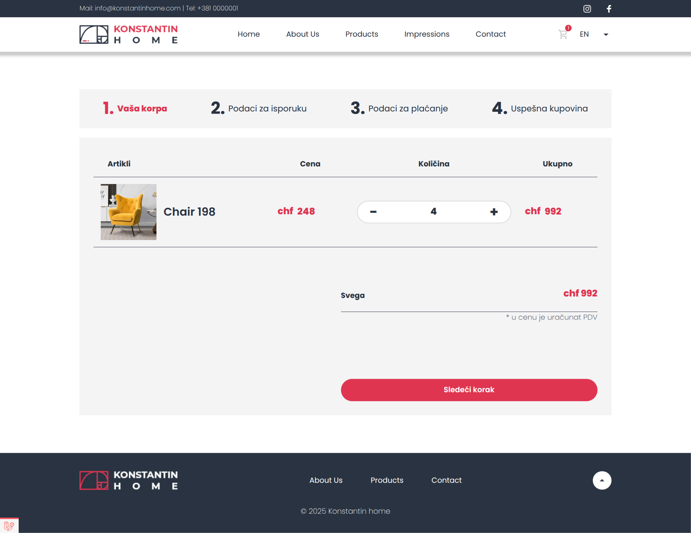
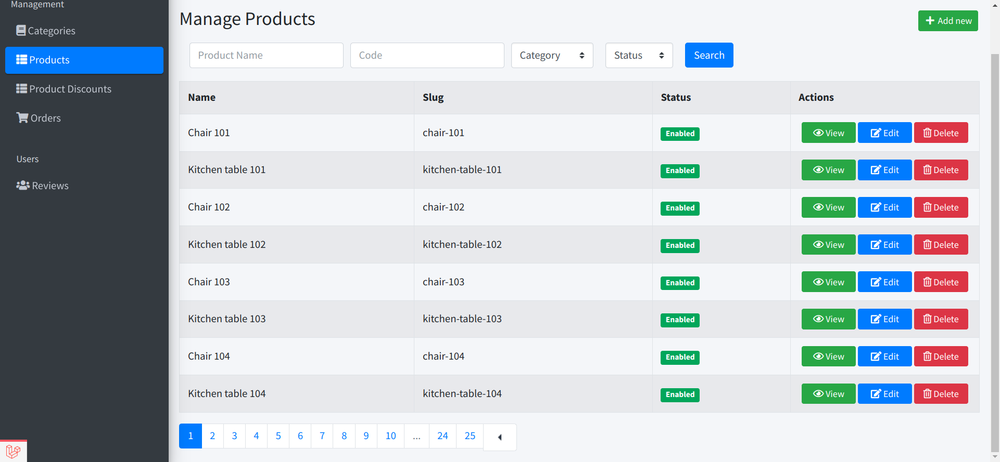
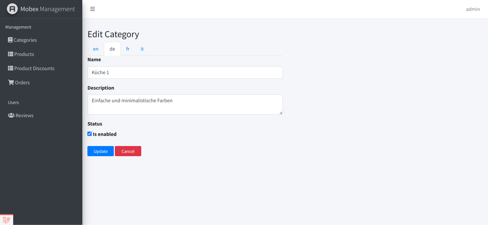

# Furniture Shop Project

This is a furniture shop project built with **Laravel 7**, featuring an online shopping cart, multi-language support, and an admin panel. It was intended to be a complete e-commerce solution with online payment integration using **Stripe**.

This project started with static **HTML**, **CSS**, and **JavaScript** files. My role was to turn these files into a working web app using **Laravel**.

I used **Blade components** to build the frontend, making the templates easy to reuse. I also created the backend to manage data, support multiple languages, and handle the shopping cart.


## Project Status

- **Project is discontinued and remains 80% complete.**
- **Last updated:** Jan 24, 2021.
- **PHP version:** 7.4
- **Laravel version:** 7.24

## Features

- **Shopping Cart:** Users can add products to their cart. Cart data is stored in both the session and the database.
- **Multi-Language Support:** The application is set up to support multiple languages.
- **Admin Panel:** The project includes an admin panel for managing the site.

## Known Issues
- Stripe payment integration is not implemented.
- Some UI components may not be fully responsive.
- No automated tests are included.
- Translations for some static text are missing.


## Screenshots


---




---




---





## Setup

To run this project locally, follow these steps:

### Requirements
- **Docker**
- **PHP 7.4**
- **Laravel 7.x**

### Installation

1. **Clone the repository:**
```bash
  git clone git@github.com:spezia/laravel-furniture-catalog-client-project.git
```
2. **Configuration:**

Follow the official [Laravel 7 documentation](https://laravel.com/docs/7.x/installation#configuration) for setup instructions.
After configuring the environment, start the Laravel development server by running:

```
php artisan serve
```

By default, the application will be available at:
```
http://127.0.0.1:8000
```


## Running with Docker

 If you want to run the project using Docker, after cloning the repository, update your hosts file

 - **Linux/macOS:** `/etc/hosts`
 - **Windows:**  `C:\Windows\System32\drivers\etc\hosts`


 by adding the following entry:
```
127.0.0.1   app.local
```

After updating the hosts file, restart your web server for the changes to take effect. 

Then, start the Docker containers by running:

```
sh start.sh
```

To stop the Docker containers, run

```
sh stop.sh
```

Once the containers are running, you can access the application at:

```
http://app.local:8000

http://app.local:8000/admin/home

```

  **Admin login credentials:**
  - **Email:** mobex@example.net
  - **Password:** wirtesten

## License

[MIT](./LICENSE)
